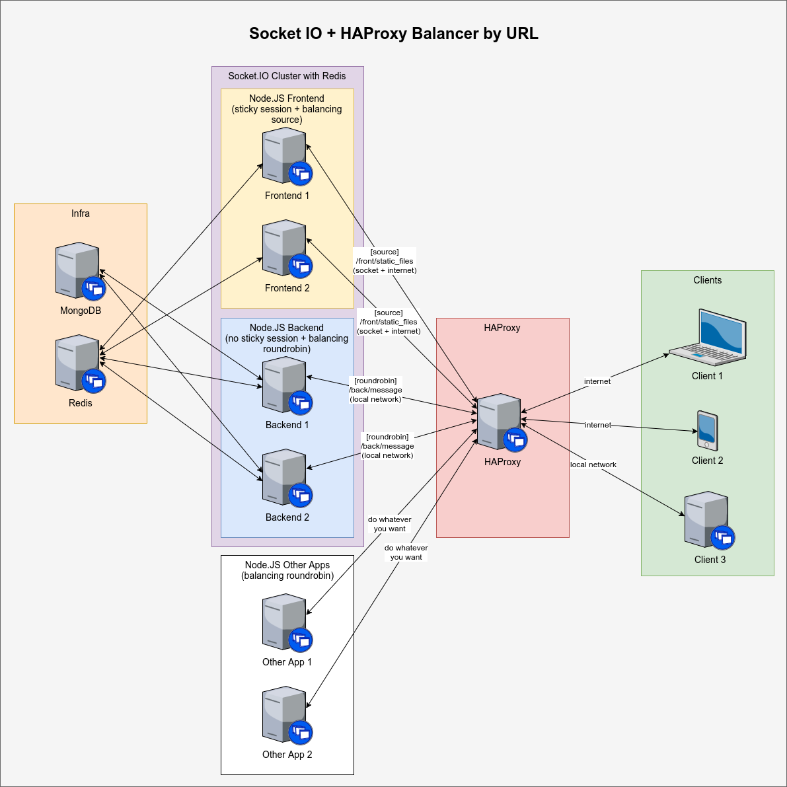

# Socket IO With HAProxy And Redis

I've made some tests and for me it was proven that this can be a possible solution to high scalable environments under high load using Socket.IO.

This repository contains a complete solution with Node.JS and Socket.IO that can be used as reference.

I've included a simple chat that can be accessed through browser to demonstrate the funcionality.

The frontend application keeps a socket open with the frontend Node.JS. Other communications are being made with the backend application.

After receiving a message, the backend application will emit the message through redis. The message will be sent through the socket open with frontend, as if it has been sent from there.

The following topics are tested:
* It's possible to use any domain that we want, emit from one to another and it work;
* It's possible to keep the socket working through HAProxy;
* It's possible to use a backend application that can suffer all high load that we want(without opening sockets with the browser);
* It's possible to use as many backend's as we want(with roundrobin balancing);
* It's possible to use as many frontend's as we want(with source balancing);
* It's possible to emit events from backend and, if the frontend has a socket open with an browser, it will work;
* It's possible to use simple acl's with HAProxy to separate service-a from service-b;
* It's possible to use as many processors on each Node.JS instance as you want;

# Architecture
The following diagram shows how the infraestructure was built. Everything can be found inside the file ```docker-compose.yml```.



# How Can I Run?
Please follow the next steps to get it working. First of all, be sure that you have all the requirements:
* docker-ce;
* docker-compose;
* At least 8Gb of RAM disponible(we are starting many machines);
* The project;

The following commands will start all containers:
```
git clone git@github.com:darlanmoraes/socket.io-redis-ha.git
cd socket.io-redis-ha
docker-compose -f docker-compose.yml up
```

Now we can create a little shortcut inside our SO to send requests through the correct hosts(or we can pass the headers):
```
# add the following lines to /etc/hosts file
127.0.1.1	www.node-services-1.com
127.0.1.1	www.node-services-2.com
```

After these steps, we can open the browser and access the following addresses to chat:
```
http://node-services-1.com/front/rooma
http://node-services-1.com/front/roomb
http://node-services-2.com/front/rooma
http://node-services-2.com/front/roomb
```

The following will send a message through the backend that has no open sockets. This should send the message to all open sockets with frontend.
```
# set all hosts that can handle requests for the servers
curl -X POST -v \
-H 'Content-Type: application/json' \
-H 'Accept: application/json' \
-d "{
  \"room\": \"roomb\",
  \"message\": \"A simple message: $(date)\"
}" \
'http://www.node-services-1.com/back/message'
```